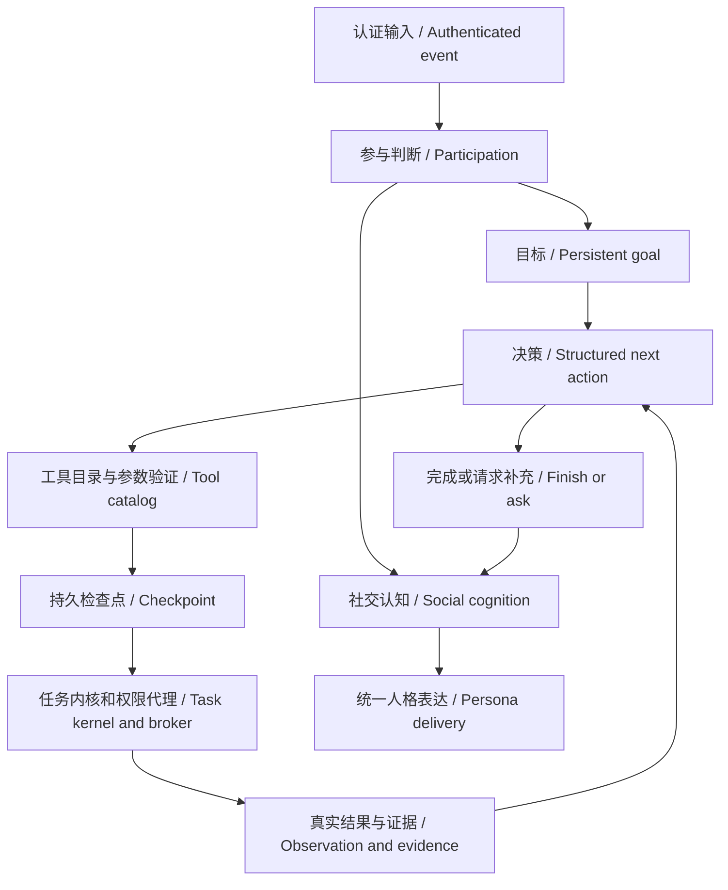

# 人格与自主目标 / Persona and autonomous goals

本次重构让 LivingAgent 同时承担自然社交与有状态的目标执行。社交侧保留参与判断、会话动量、人格、心理状态、分层记忆、可中断的分段表达；执行侧从一次性的固定步骤解析扩展为观察驱动的目标循环。

LivingAgent now combines its existing social persona with persistent, observation-driven goals. Social participation, memory scope and delivery remain separate from executive decisions.

## 运行 / Run

```bash
uv sync --all-groups
uv run uvicorn --app-dir src living_agent.app:app --host 127.0.0.1 --port 8000
```

在 `/studio#agent` 的“智能体”页面输入目标。默认 Mock 模式可演示：`检查工作区并读取 README`。它会真正列出配置的工作区、根据目录结果选择 README、读取文件并保存证据；工作区缺少 README 时，可在补充信息中提供有效的相对文件路径。不需要模型密钥。工作区使用 `LIVING_AGENT_WORK_WORKSPACE_ROOT`。

Open `/studio#agent`. In Mock mode, try `检查工作区并读取 README`. This performs real local directory listing and file reading; it does not simulate filesystem results.

开放式目标需要按现有 [模型配置](integrations/cloud-model-api.md) 配置 `openai_compatible`。决策器复用现有连接池、超时与重试机制，但使用独立结构化协议。Mock 只验证明确的目录 → README → 结果链路，其他目标会请求配置真实模型。

Open-ended goals require an OpenAI-compatible model. The deterministic Mock recipe is a reproducible demo, not a substitute for model planning.

## 聊天 / Chat

经过认证的所有者或管理员可以发送：

```text
agent: 检查工作区并读取 README，告诉我项目用途
智能体: 找出文档中的安装步骤，整理成一份说明
自主任务: 搜索工作区中 TODO 的位置，再阅读相关文件
```

固定的“计算”“读取文件”“运行测试”等命令继续走确定性快速路径；未被快速路径识别且以“帮我”“请帮我”“麻烦你”开头的请求进入目标循环。普通聊天继续走现有社交路径。群聊仍先经过参与判断，普通成员不能因此获得工作区或执行权限。

Explicit `agent:` goals enter the loop; existing deterministic commands retain their fast path. Unmatched trusted requests beginning with the documented Chinese request prefixes also enter the loop. Ordinary social messages and group participation retain their existing routing.

等待确认、等待补充、暂停的目标会给出 ID，可使用：

```text
查看智能体 <run_id>
确认智能体 <run_id>
继续智能体 <run_id> 补充的信息
取消智能体 <run_id>
```

控制命令绑定原会话。确认、继续和取消要求所有者身份。完整参数与历史结果可以在控制台查看。确认只覆盖已保存的那一次动作，之后的新写入仍需确认。

Controls are bound to the originating conversation. Confirmation, continuation and cancellation require the owner. Confirmation authorizes only the exact saved action, not later writes.

## 核心结构 / Architecture



- `agent/contracts.py`：目标、结构化决策、观察和有界状态。
- `agent/planner.py`：原目标、范围内记忆、心理状态及工具结果分别编译，模型只决定下一步；近期结果有总量约束，完整执行结果留在子任务。
- `execution/tool_catalog.py`：11 个已有工具的参数模式、能力、操作、资源范围与确认要求。模型规划与任务验证共用声明。
- `agent/tools.py`：宿主生成身份、能力请求、来源链和任务 ID；模型不能声明授权。
- `agent/service.py`：观察 → 决策 → 保存提案 → 执行 → 再观察；负责预算、重复行动检测、等待、取消和恢复。
- `agent/repository.py`：数据库 JSON 检查点与版本比较更新。
- `execution/conversation.py`：从主运行时抽出的确定性任务与控制命令分派。
- `cognition/outcomes.py`：任务与 Agent 结果共用人格表达及连续性证据检查。
- `cognition/model_calls.py`：统一社交模型调用审计与响应审查。
- `runtime/delivery.py`、`runtime/memory_probe.py`：实际交付记录与隔离探针独立于聊天调度。
- `cognition/social.py`：呈现宿主控制消息和工具证据；执行器不持有平台发送能力。

The tool registry is the shared source of schemas and scopes. The model cannot choose actor identity, grants or evidence. Every action becomes an ordinary brokered child task, retaining existing execution checks.

## 状态与恢复 / State and recovery

| 状态 / State | 含义 / Meaning |
| --- | --- |
| `running` | 正在决策或执行 / Deciding or executing |
| `waiting_confirmation` | 精确动作已保存，等待所有者 / Exact action awaits owner |
| `waiting_input` | 缺少信息，需要补充 / Additional input required |
| `paused` | 请求中断或进程重启 / Request interrupted or process restarted |
| `completed` | 模型声明目标完成，引用成功子任务的真实证据 / Model completion with observed tool evidence |
| `failed` | 协议错误、预算耗尽或循环失败 / Protocol, budget or loop failure |
| `cancelled` | 停止后续规划，保留既有结果 / Stop future planning; retain prior effects |

迁移 `0014_agent_runs` 新增表，不改写旧任务、记忆和人格。服务启动时把中断的 `running` 目标暂停，不自动重新调用模型。继续时先根据已保存的子任务 ID 读取真实状态，已完成的操作不重放。原任务内核负责其自身恢复，写入与进程保留原有重启后再确认规则。

Migration `0014_agent_runs` adds a table. Startup pauses interrupted goals. Resumption reconciles saved child task IDs before deciding anything new. Completed effects are not replayed. Existing task recovery retains write reconfirmation.

取消不会回滚已经完成的操作；宿主先持久化取消状态，再中断决策驱动并取消未结束的子任务。Shell 执行沿用任务内核的进程清理。已经开始的短文件或计划写入先保存真实结果和证据，再结束目标，避免落盘影响失去记录。此版本使用单进程服务，运行时协调与任务内核尚不支持多 worker 的分布式执行。不要以多个 Uvicorn worker 共用同一数据库。

Cancellation persists the terminal state before interrupting the active driver and cancelling unfinished child tasks. Shell cancellation uses existing process cleanup. Started short file/plan writes finish and retain evidence before the goal stops; completed effects remain. Use one application worker; distributed leases and multi-worker execution are not implemented.

## API

所有接口都使用已有管理端认证：`X-Actor-ID`，生产环境另需 Bearer 管理令牌。

直接 `/v1/chat` 中声明 `authenticated=true` 的请求，在生产或配置了管理令牌的环境中同样必须携带 `Authorization: Bearer <management_api_token>`。客户端自报所有者 ID 不能替代凭据。`authenticated=false` 可用于匿名社交；NapCat/OpenClaw 继续使用各自的入站认证。

Authenticated direct chat requires the existing management Bearer token in production or whenever a token is configured. Platform adapters retain their own authentication boundaries.

| Method | Path | Action |
| --- | --- | --- |
| GET | `/v1/agent/tools` | 工具声明 / Tool declarations |
| POST | `/v1/agent/runs` | `{ "goal": "…", "conversation_id": "…" }` |
| GET | `/v1/agent/runs` | 目标列表 / List goals |
| GET | `/v1/agent/runs/{run_id}` | 检查点与结果 / Checkpoint and observations |
| POST | `/v1/agent/runs/{run_id}/confirm` | 确认当前精确动作并继续 / Confirm current action |
| POST | `/v1/agent/runs/{run_id}/resume` | `{ "message": "补充信息" }`，暂停目标可用 `{}` |
| POST | `/v1/agent/runs/{run_id}/cancel` | 取消后续行动 / Cancel further actions |

启动、继续与确认接口会等待本段循环结束；另一个请求可随时读取已保存进度。默认总决策预算为 8 次，每次最长 90 秒；暂停、补充、恢复不会重置预算。连续重复相同工具参数第三次会停止；其他动作改变了状态后允许重新读取。`LIVING_AGENT_AGENT_ENABLED=false` 可关闭新目标循环。

Start/resume/confirm await the current bounded segment. Progress is readable concurrently. The default lifetime budget is 8 model decisions, each with a 90-second deadline. Resumption does not reset the budget. A third consecutive identical tool call is rejected; an intervening action permits a later reread.

## 验证边界 / Verification limits

完成状态核验的是引用的子任务确有成功状态和宿主证据，不能机械证明任意自然语言目标已经满足。模型仍可能误解任务或总结不准确，应结合完整输出检查。模型没有自由 Shell、删除、外部消息发送或策略修改工具；文件、网页、进程沿用宿主限制。

Evidence references verify successful tool execution, not semantic correctness of arbitrary goals. A model can still misunderstand a goal. Inspect observations for consequential outcomes. Existing workspace, network, process and confirmation controls apply.

本地测试使用 Mock 或脚本化模型与临时目录。真实模型服务、QQ 和微信投递需要独立联调，不能由本地通过推断。

Local acceptance uses Mock/scripted providers and temporary workspaces. Live model quality and QQ/WeChat delivery require separate integration validation.

## 本机验证环境说明 / Local validation environment

本次在隔离的 Homebrew Python 3.12 环境中验证，没有改动现有 `.venv` 和业务数据库。如果 macOS 云盘上的旧虚拟环境或 `__pycache__` 出现长时间读取阻塞，可另建环境并将字节码缓存放在本机缓存目录：

```bash
UV_PROJECT_ENVIRONMENT=.venv-agent uv sync --python /opt/homebrew/bin/python3.12 --frozen --all-groups
PYTHONPYCACHEPREFIX="$HOME/Library/Caches/LivingAgent/pycache" \
UV_PROJECT_ENVIRONMENT=.venv-agent \
uv run uvicorn --app-dir src living_agent.app:app --host 127.0.0.1 --port 8000
```

这里的 Python 路径针对 Apple Silicon Homebrew；其他机器应使用其本机受支持的 Python 安装。0.3.0 的 macOS 插件沙箱仅放行所选解释器标准库和必要运行文件的只读访问，并禁用 site-packages/.pth。Homebrew 与位于主目录的 uv Python 3.12.13 均通过实际插件及越界探针；没有放开主目录或禁用沙箱。

These fallback commands preserve the old environment and use a separate bytecode cache. The interpreter path is specific to Apple Silicon Homebrew. Version 0.3.0 permits only the selected interpreter's standard library and required runtime files. Real Homebrew and home-installed uv Python plugin/probe tests passed while host data, writes, networking and child processes remained blocked.
